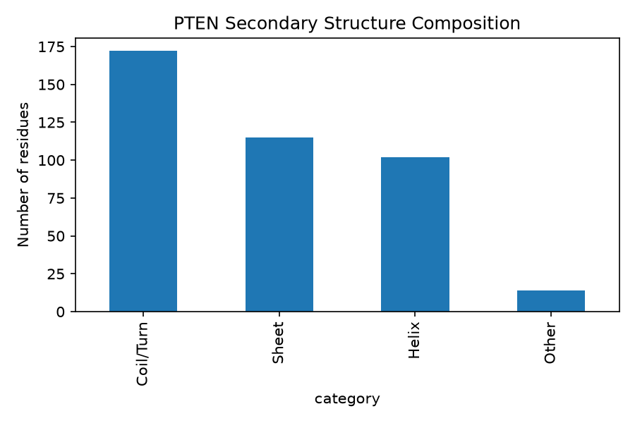

# pten-structural-analysis
PTEN Structural Analysis explores the structural biology of the PTEN protein through computational and bioinformatics approaches. This repository includes tools, workflows, and analyses for studying PTEN's three-dimensional structure, functional domains, mutations, and protein stability.

## Goal
Analyse the human PTEN sequence and structure using bioinformatics tools.

## Data Sources
- NCBI RefSeq — PTEN mRNA sequence retrieval
- AlphaFold — predicted PTEN protein structure

## Biological Background

PTEN (phosphatase and tensin homolog) is a tumour suppressor protein involved in regulating the PI3K/AKT signalling pathway, which controls important cellular processes such as growth, survival, and metabolism.

Mutations or structural changes in PTEN can affect its function and are associated with several human diseases, including cancer. This project uses computational bioinformatics approaches to analyse the PTEN sequence and predicted protein structure.

## Pipeline
1. Retrieve PTEN mRNA sequence
2. Predict PTEN protein sequence from the ORF
3. Obtain predicted AlphaFold structure
4. Calculate DSSP secondary structure assignments
5. Visualise secondary structure composition

## Results
- PTEN mRNA sequence (`PTEN_mRNA.fasta`)
- Predicted PTEN protein sequence (`PTEN_protein.fasta`)
- AlphaFold structure (`PTEN_alphafold.pdb`)
- DSSP secondary structure data (`PTEN_secondary_structure.csv`)
- Secondary structure composition plot (`PTEN_secondary_structure_plot.png`)

### Secondary Structure Composition


## Installation

### 1. Clone the repository

```bash
git clone https://github.com/miraethh/pten-structural-analysis.git
cd pten-structural-analysis
```

### 2. Create a virtual environment

```bash
python3 -m venv venv
source venv/bin/activate
```

### 3. Install Python dependencies

```bash
pip install -r requirements.txt
```

### 4. Install DSSP

DSSP is required for secondary structure analysis.

Using Conda:

```bash
conda install -c salilab dssp
```

## Requirements

Python packages:

- Biopython
- pandas
- matplotlib
- requests

External tools:

- DSSP (mkdssp)
- Conda (recommended for DSSP installation)

## Running the Pipeline

Run the scripts in order:

```bash
python scripts/01_fetch_sequence.py
python scripts/02_find_orf.py
python scripts/03_fetch_structure.py
python scripts/04_secondary_structure.py
python scripts/05_visualize.py
```
